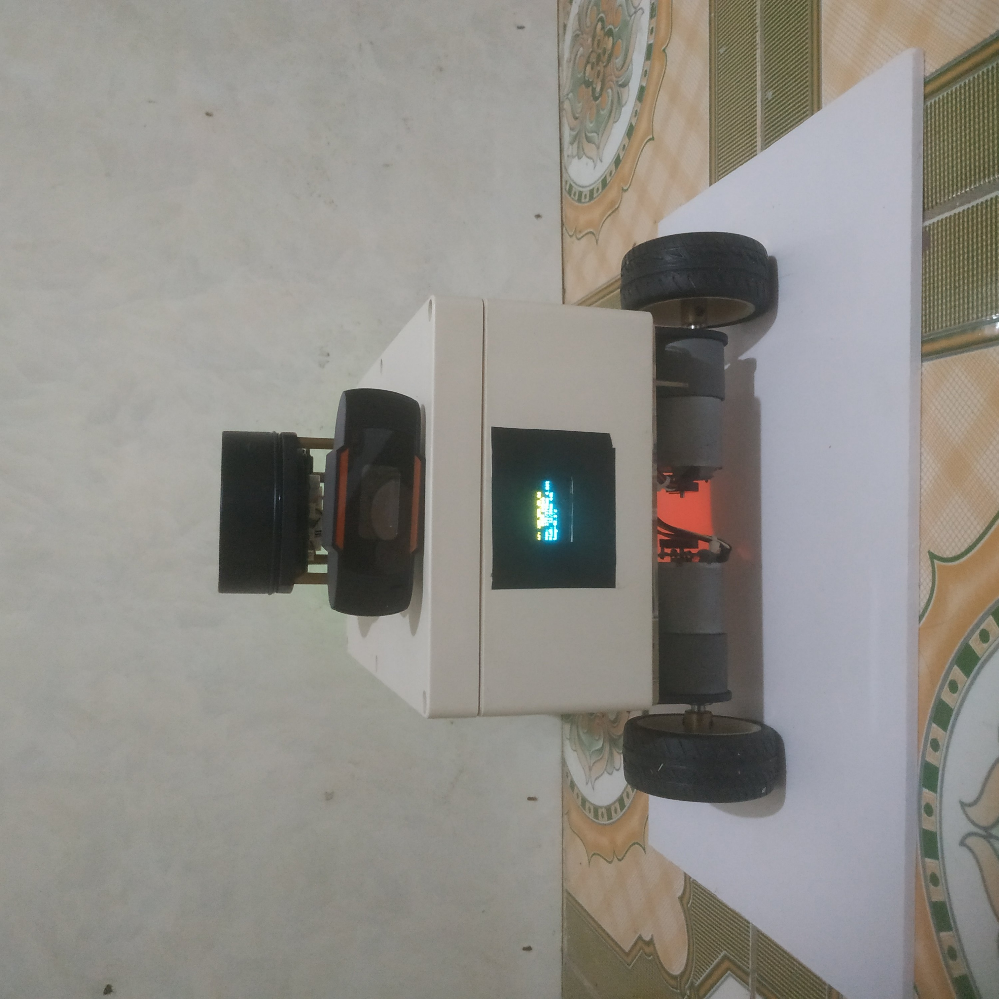

## Diff_robot

Robot điều khiển vi sai phát triển trên ROS 2



### Phần cứng

| Number | Module | Part |
|:--:|:--:|:-----------------------:|
| 1 | SBC | Raspberry Pi 4 B (4 Gb) | 
| 2 | Khung xe |  Hộp nhựa (23x15x7.5 cm) |
| 3 | Motors | 2 x Động cơ encoder giảm tốc GB37-3530 |
| 4 | Microcontroller | Arduino Uno |
| 5 | Motor Driver | Module L298N |
| 6 | Laser Scanner |	RPLidar A1M8 |
| 6 | Camera |	Webcam HD 720p |

## :mechanical_arm: Cài đặt

### Nền tảng

- ROS 2: Humble Hawksbill
- OS:
  - Ubuntu 22.04 (WSL2)
  - Ubuntu 22.04 (Trên Raspberry Pi 4B)

### Build from Source

#### Phụ thuộc

1. Cài đặt [ROS 2](https://docs.ros.org/en/humble/Installation/Ubuntu-Install-Debians.html)
2. Cài đặt [colcon](https://colcon.readthedocs.io/en/released/user/installation.html)

#### colcon workspace

1. Tạo không gian làm việc

```
mkdir -p ~/dev_ws/src
```

2. Clone package vào thư mục src

```
cd ~/dev_ws/src
```

```
git clone https://github.com/Huysiunhan02/huybot.git
```

3. Install dependencies via `rosdep`

```
cd ~/dev_ws
```

```
rosdep install --from-paths src --ignore-src -i -y
```

4. Build packages

```
colcon build
```

5. Source the built packages

```
source install/setup.bash
```

### Slam

```
ros2 launch huybot_slam slam_toolbox_online_async.launch.py
```

### Navigation

```
ros2 launch huybot_slam bringup.launch.py
```

## :star2: Tham khảo
 * [articubot_one](https://github.com/joshnewans/articubot_one)
 * [andino](https://github.com/Ekumen-OS/andino)